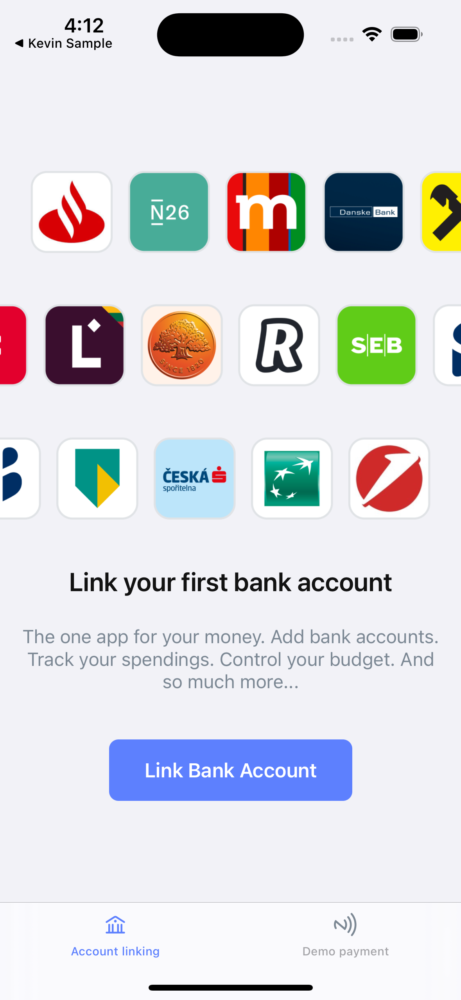
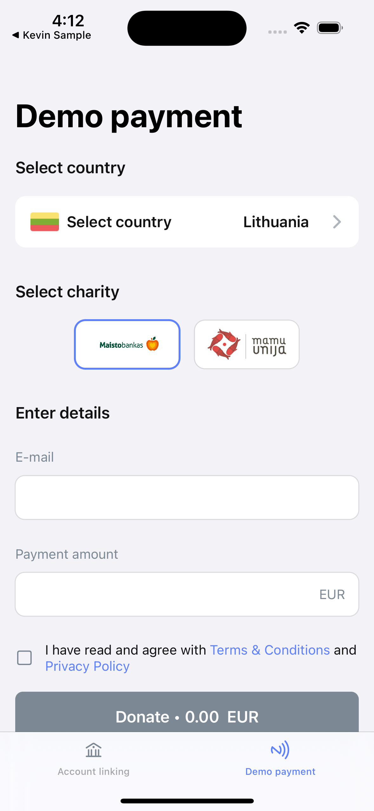

kevin. iOS SDK Demo is showcase of a fully featured iOS application utilising kevin. SDK

If you are a developer looking to quickly get started with implementing the SDK in your project, we recommend starting with our [kevin. SDK](https://github.com/getkevin/kevin-ios) samples.

Visit our [Developer Portal](https://developer.kevin.eu/home/mobile-sdk/getting-started) for more information.

## Screenshots

   
   

